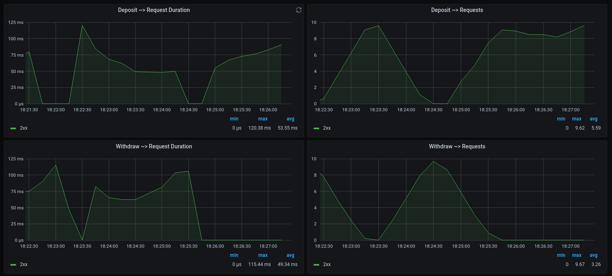

# Monitorando a aplicação com grafana

Dados relacionados a performace e uso de recursos na aplicação são coletados usando a biblioteca [`prometheus.ex`](https://github.com/deadtrickster/prometheus.ex), armazenados no banco de dados [`Prometheus`](https://prometheus.io/) e exibidos através de gráficos com o uso da ferramenta [`Grafana`](https://grafana.com/).

Métricas especificas relacionadas ao banco de dados são coletadas pela ferramenta [`postgres_exporter`](https://github.com/prometheus-community/postgres_exporter).

## Organização das métricas

As métricas coletadas podem ser vistas através do endereço [http://localhost:3000](http://localhost:3000), e estão divididas em três paineis. São eles:

  - **General**: Exibe um panorama geral do estado atual da aplicação. Dentre as métricas exibidas, estão: uso de cpu, memória e tempo de resposta de requisições.
  - **Requests**: Detalha número de requisições e tempo de resposta em rotas especificas da aplicação. O tempo de resposta e número de requisições são agrupados por tipo de resposta (*1xx*, *2xx*, *3xx*, *4xx* e *5xx*).
  - **Postgres**: Exibe métricas relacionadas ao banco de dados, como número de operações realizadas (*selects*, *inserts*, *updates* e *delets*), percentual de respostas *cacheadas* e número de *quesries* por segundo.

## Screenshots

| General Dashboard |
|:-----------------:|
|  |

| Requests Dashboard |
|:------------------:|
|  |

| Postgres Dashboard |
|:------------------:|
|  |